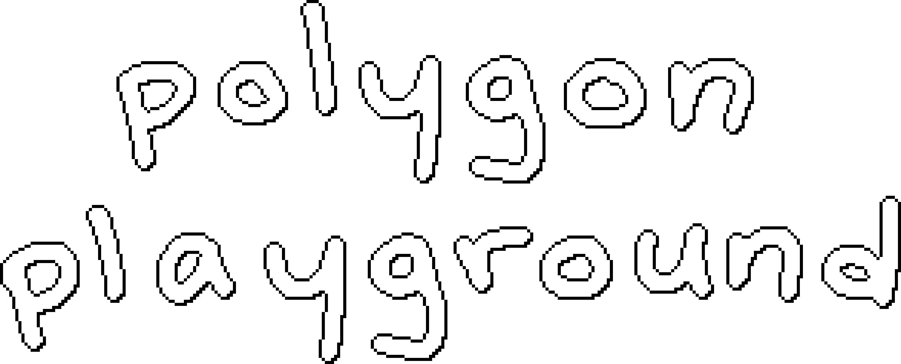
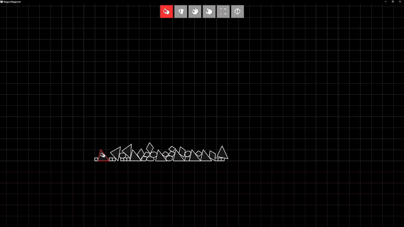
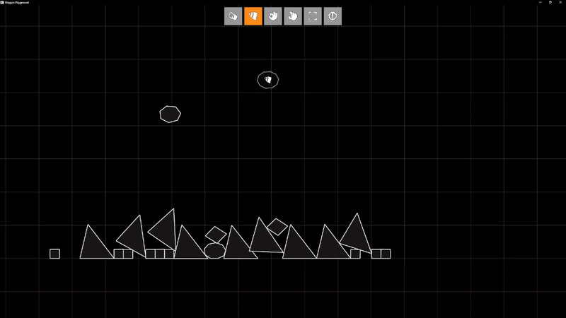
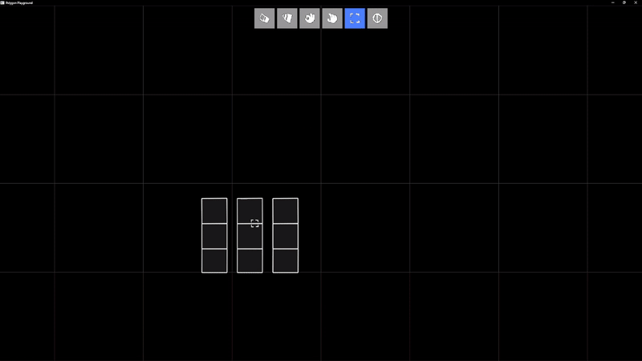
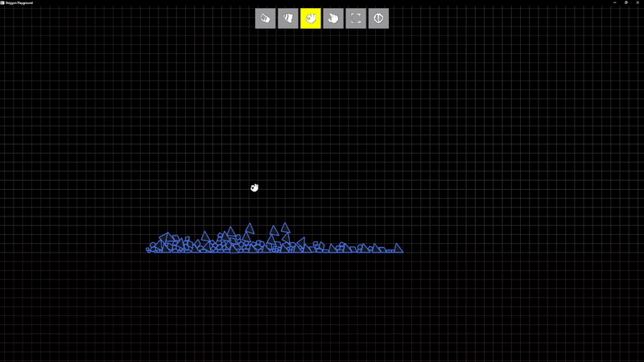

<p align="center">
  
</p>

<br></br>
**polygon playground** is a physics-based 2D interaction sandbox inspired by Boom Blox Bash Party. Built using modern C++ and OpenGL, it allows users to create, manipulate, and destroy polygon structures with a variety of tools. See the demo and more at [https://hannaharmon.github.io/polygon-playground/](https://hannaharmon.github.io/polygon-playground/).

## ⇨ features

- Real-time interaction with 2D polygon objects
- Slingshot and Grab mechanics
- Support for rotation, resizing, selection, and flicking
- Custom pixel-style UI and tool icons
- Minimalist OpenGL-based rendering with a grid background

---

## ⇨ controls

### Tools:
<p style="margin-top:4rem;">
    
</p>

#### Eraser: 1, E
- Click on a polygon to delete it.
- Select many polygons, then click one to delete all.

<p style="margin-top:4rem;">
    
</p>

#### Pencil: 2, P
- Click to create polygons.
- Scroll to increase height.
- Shift + scroll to increase width.
- Ctrl + scroll to rotate.
- Right click to cycle # of edges.

<p style="margin-top:4rem;">
    
</p>

#### Flick: 3, F
- Click on a polygon drag to change flick force, and release to flick it
- Select many polygons, then click and drag on one of them to flick them all.

<p style="margin-top:4rem;">
    
</p>

#### Grab: 4, G
- Click and drag on a polygon to grab and move it
- Select many polygons, then click and drag anywhere in space to move them all

<p style="margin-top:4rem;">
    
</p>

#### Select: 5, S
- Click and drag to create a selection rectangle. Polygons within the rectangle on release become selected.

<p style="margin-top:4rem;">
    
</p>

#### View: 6, V (Space for quick swap)
- Mouse wheel to zoom in or out
- Left click to pan

### Shortcuts:
#### Delete: Del
- deletes selected polygons
#### Copy: Ctrl+C 
- Copy selected polygons to clipboard
#### Cut: Ctrl+X
- Cut selected polygons (copy and delete)
#### Paste: Ctrl+V 
- Paste polygons from clipboard at cursor position
#### Duplicate: Ctrl+D
- Clone selected polygons to cursor position

### Other
#### R: Reset
#### ESC: Quit


---

## ⇨ setup

### ❑ install dependencies

Before building, ensure the following libraries are installed:

- [GLFW](https://www.glfw.org/)
- [GLEW](http://glew.sourceforge.net/)
- [OpenGL](https://www.opengl.org/)
- [GLM](https://github.com/g-truc/glm)
- [Eigen](https://eigen.tuxfamily.org/)
- `stb_image.h` (included)
- CMake (version 3.10 or higher)

You can install the dependencies using your system's package manager:

**Ubuntu/Debian:**
```bash
sudo apt update
sudo apt install cmake libglfw3-dev libglew-dev libglm-dev libeigen3-dev
```

**macOS (Homebrew):**
```bash
brew install cmake glfw glew glm eigen
```

**Windows:**
- Use [vcpkg](https://github.com/microsoft/vcpkg) or download prebuilt binaries.
- Be sure to add include/library paths in your CMake GUI.

---
### ❑ environment variables

Before running CMake, make sure you have the following environment variables defined, pointing to the root directories of each dependency:

| Variable Name         | Description                        |
|-----------------------|------------------------------------|
| `GLFW_DIR`            | Root directory of GLFW             |
| `GLEW_DIR`            | Root directory of GLEW             |
| `GLM_INCLUDE_DIR`     | Path to GLM include directory      |
| `EIGEN3_INCLUDE_DIR`  | Path to Eigen include directory    |
<span style="line-height: 1;">&nbsp;</span>

**Windows:**

Open **Command Prompt** or **PowerShell**, then run:
```bash
setx GLFW_DIR "C:\path\to\glfw"
setx GLEW_DIR "C:\path\to\glew"
setx GLM_INCLUDE_DIR "C:\path\to\glm"
setx EIGEN3_INCLUDE_DIR "C:\path\to\eigen"
```

Or temporarily for the current session:
```bash
set GLFW_DIR=C:\path\to\glfw
```

#### macOS / Linux

Add to your `.bashrc`, `.zshrc`, or run in the terminal:
```bash
export GLFW_DIR=/path/to/glfw
export GLEW_DIR=/path/to/glew
export GLM_INCLUDE_DIR=/path/to/glm
export EIGEN3_INCLUDE_DIR=/path/to/eigen
```

---


## ⇨ building with CMake

### ❑ option 1: Command Line

```bash
git clone https://github.com/your-username/polygon-playground.git
cd polygon-playground
mkdir build
cd build
cmake ..
cmake --build .
```

### ❑ option 2: CMake GUI (Windows/macOS)

1. Open **CMake GUI**
2. Set **"Source"** to the root of this project
3. Set **"Build"** to a new `/build` folder
4. Click **Configure**
5. Choose your compiler (e.g., Visual Studio, GCC, Clang)
6. Click **Generate**
7. Open the generated project in your IDE or click **Open Project**

---

## ⇨ run

After building, run the executable:
```bash
./PolygonPlayground
```
(On Windows: `PolygonPlayground.exe`)

Or, use run option in IDE. Run in release mode for best performance.

---
